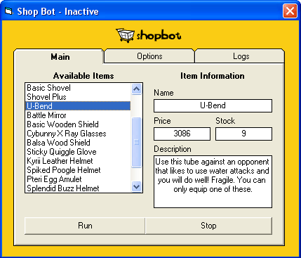

## Neopets Shop Bot \(Autobuyer\)

### Description

July 1st, 2004 - Neopets keeps changing their restock process in small ways. For now, use this only as a source reference and do not run or risk being frozen.

This is an autobuyer for the online game Neopets. If you're looking for this code, you probably know what an autobuyer does. Everything was coded by me for me, but since I don't play Neopets anymore I'm making it available to the public. Enjoy. A compiled version is available at www.geocities.com/machiavelliansquared
 
### More Info
 

             |
---                |---
**Submitted On**   |2004-07-01 15:42:22
**By**             |[Machiavellian](https://github.com/Planet-Source-Code/PSCIndex/blob/master/ByAuthor/machiavellian.md)
**Level**          |Beginner
**User Rating**    |4.8 (24 globes from 5 users)
**Compatibility**  |VB 6\.0
**Category**       |[Internet/ HTML](https://github.com/Planet-Source-Code/PSCIndex/blob/master/ByCategory/internet-html__1-34.md)
**World**          |[Visual Basic](https://github.com/Planet-Source-Code/PSCIndex/blob/master/ByWorld/visual-basic.md)
**Archive File**   |[Neopets\_Sh176462712004\.zip](https://github.com/Planet-Source-Code/machiavellian-neopets-shop-bot-autobuyer__1-54478/archive/master.zip)

